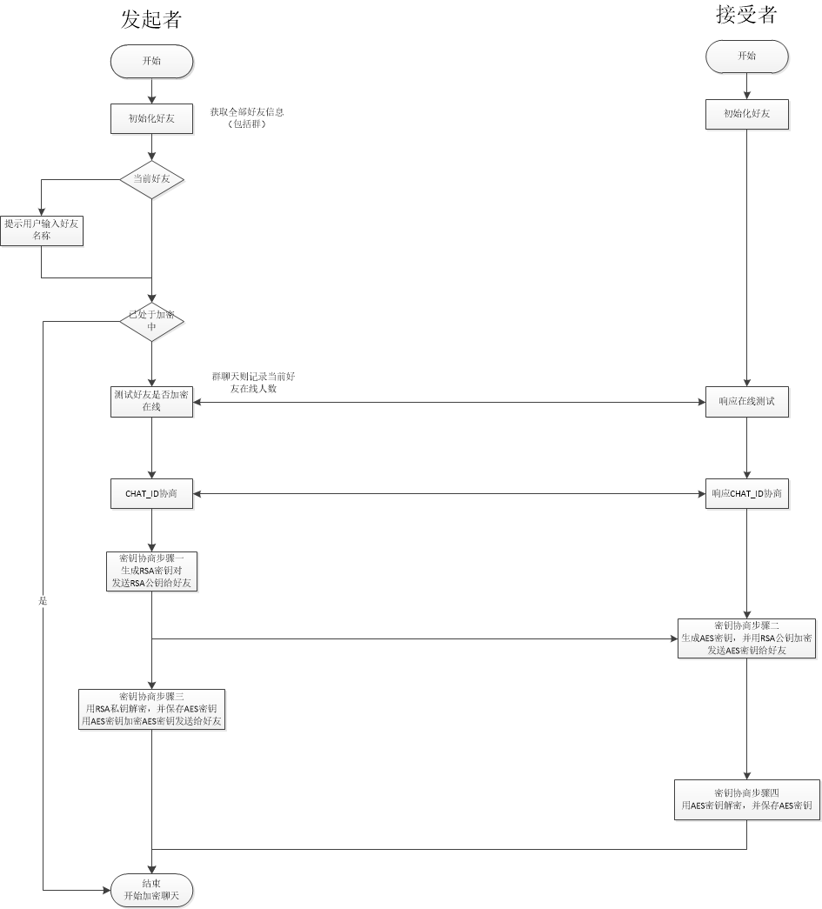

# myChat
    一个基于微信的加密聊天工具，让腾讯无处窥探你的聊天内容
```
1、本程序采用RSA进行密钥分发，AES对消息进行加密，AES密钥长度32位分，每个会话采用独立密钥
2、支持好友聊天
3、支持群聊，支持部分群好友聊天
4、密钥每十分钟更新一次，可以在config/config修改更新周期
```
# 原理图


## 前置条件
    本程序由python编写，依赖python运行环境
    本程序依赖外部库：itchat,aes,rsa
    安装依赖库命令: pip install XXX,其中XXX为库名称
### 使用
### 启动
1、进入工程目录，执行以下命令，完成程序的启动
```
    python my_chat.py
```
2、程序启动后，安装提示输入需要聊天的好友名称
    @ + 好友名称
    等待提示加密完成，即可开始加密

## 配置说明
config.go文件中可对程序进行配置
1、RSA_KEY_LEN： RSA密钥长度
2、AES_KEY_LEN： AES密钥长度
3、UPDATE_KEY_DURATION: 密钥更新周期
